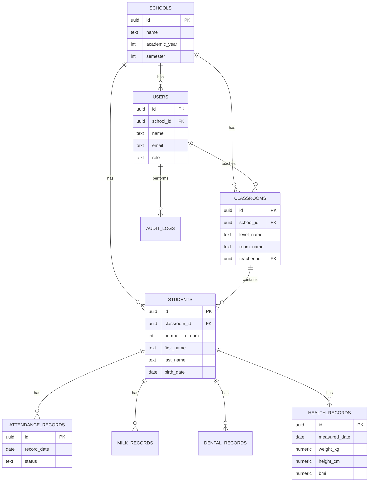
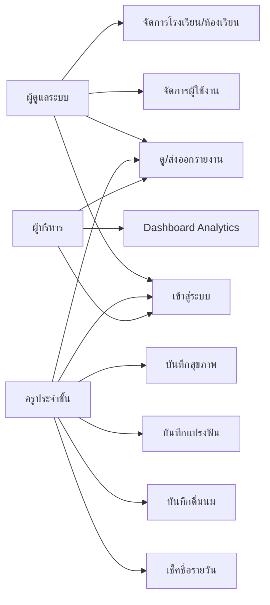
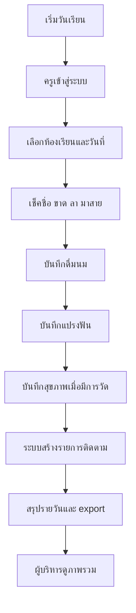

# Diagrams

## ER Diagram

```mermaid
erDiagram
  SCHOOLS ||--o{ USERS : has
  SCHOOLS ||--o{ CLASSROOMS : has
  SCHOOLS ||--o{ STUDENTS : has
  CLASSROOMS ||--o{ STUDENTS : contains
  USERS ||--o{ CLASSROOMS : teaches
  STUDENTS ||--o{ ATTENDANCE_RECORDS : has
  STUDENTS ||--o{ MILK_RECORDS : has
  STUDENTS ||--o{ DENTAL_RECORDS : has
  STUDENTS ||--o{ HEALTH_RECORDS : has
  USERS ||--o{ AUDIT_LOGS : performs

  SCHOOLS {
    uuid id PK
    text name
    int academic_year
    int semester
  }
  USERS {
    uuid id PK
    uuid school_id FK
    text name
    text email
    text role
  }
  CLASSROOMS {
    uuid id PK
    uuid school_id FK
    text level_name
    text room_name
    uuid teacher_id FK
  }
  STUDENTS {
    uuid id PK
    uuid classroom_id FK
    int number_in_room
    text first_name
    text last_name
    date birth_date
  }
  ATTENDANCE_RECORDS {
    uuid id PK
    date record_date
    text status
  }
  HEALTH_RECORDS {
    uuid id PK
    date measured_date
    numeric weight_kg
    numeric height_cm
    numeric bmi
  }
```

## Use Case Diagram

```mermaid
flowchart LR
  Admin["ผู้ดูแลระบบ"]
  Teacher["ครูประจำชั้น"]
  Executive["ผู้บริหาร"]
  Auth["เข้าสู่ระบบ"]
  ManageUsers["จัดการผู้ใช้งาน"]
  ManageSchool["จัดการโรงเรียน/ห้องเรียน"]
  Attendance["เช็คชื่อรายวัน"]
  Milk["บันทึกดื่มนม"]
  Dental["บันทึกแปรงฟัน"]
  Health["บันทึกสุขภาพ"]
  Reports["ดู/ส่งออกรายงาน"]
  Dashboard["Dashboard Analytics"]

  Admin --> Auth
  Admin --> ManageUsers
  Admin --> ManageSchool
  Admin --> Reports
  Teacher --> Auth
  Teacher --> Attendance
  Teacher --> Milk
  Teacher --> Dental
  Teacher --> Health
  Teacher --> Reports
  Executive --> Auth
  Executive --> Dashboard
  Executive --> Reports
```

## Daily Workflow

```mermaid
flowchart TD
  Start["เริ่มวันเรียน"]
  Login["ครูเข้าสู่ระบบ"]
  SelectClass["เลือกห้องเรียนและวันที่"]
  Attendance["เช็คชื่อ ขาด ลา มาสาย"]
  Milk["บันทึกดื่มนม"]
  Dental["บันทึกแปรงฟัน"]
  Health["บันทึกสุขภาพเมื่อมีการวัด"]
  Alert["ระบบสร้างรายการติดตาม"]
  Report["สรุปรายวันและ export"]
  End["ผู้บริหารดูภาพรวม"]

  Start --> Login --> SelectClass --> Attendance --> Milk --> Dental --> Health --> Alert --> Report --> End
```
